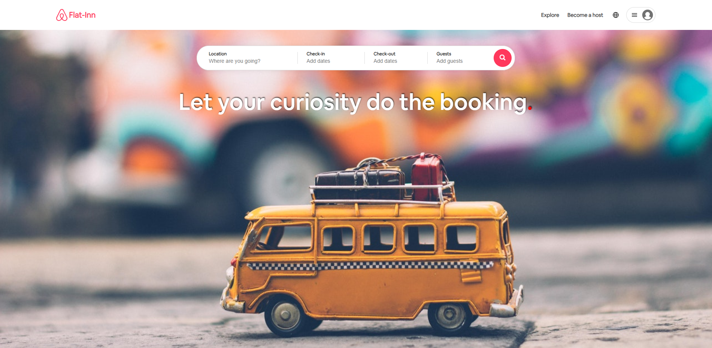

# Flat-Inn

I'm happy to share the final project of my studies: Flat-Inn.

## Description

Flat-Inn, an Airbnb like application, let you explore between a variety of destinations, make an order of a desired destination and manage your stays and orders as a host.

## Software and Languages used

Vue 3 CLI (using Vite), SCSS, NodeJS (with Express.js) and MongoDB Atlas.

Hope you'd like it!

<a href="https://flatinn.onrender.com" target="blank">Link to the Project</a>
 
<a href="https://github.com/barakz13/flatinn-backend">Link to the Backend Repository</a>

